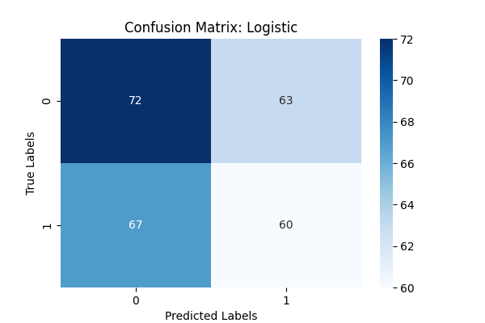
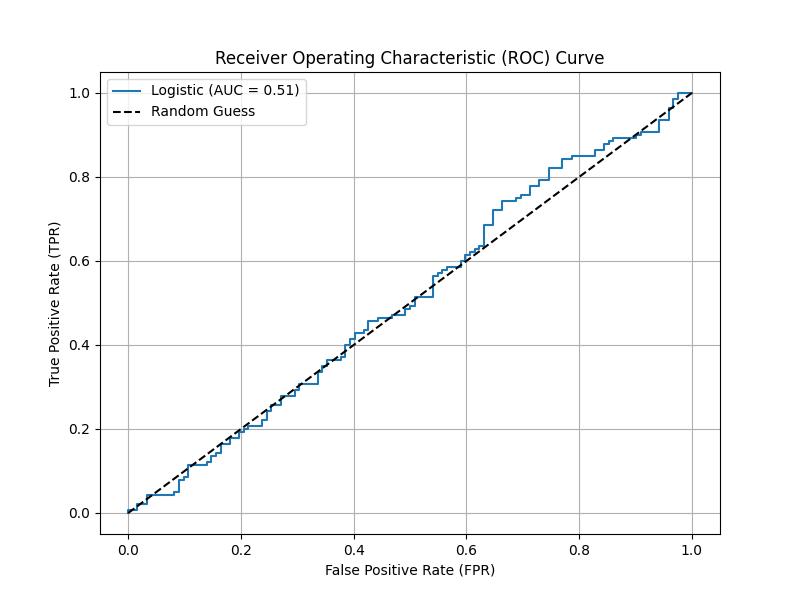
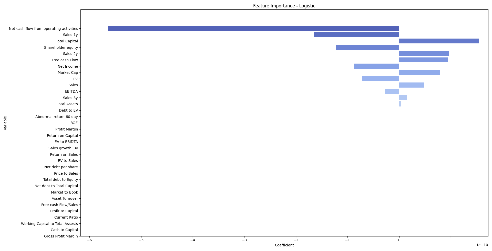
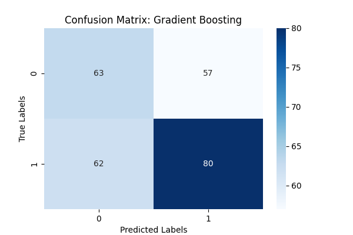
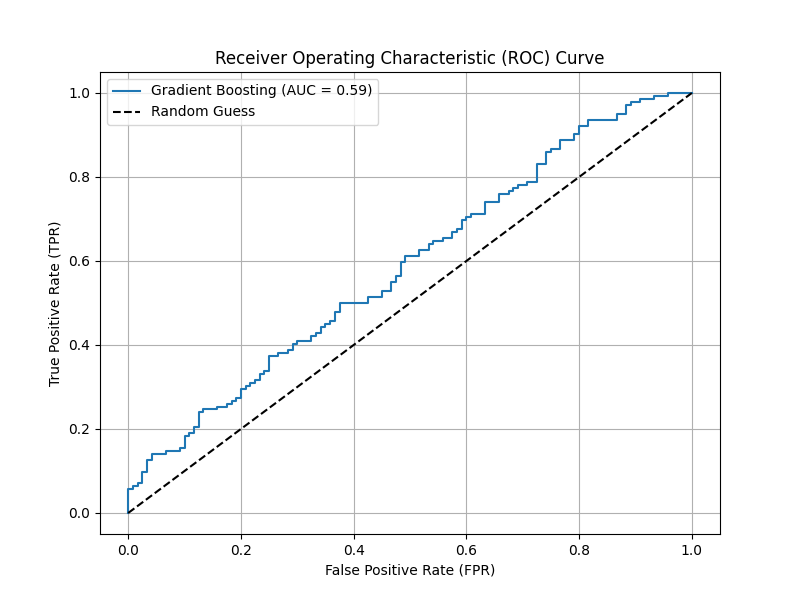
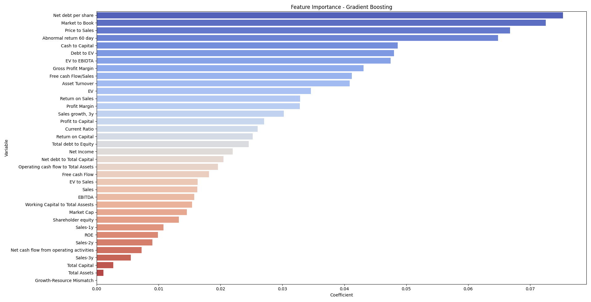
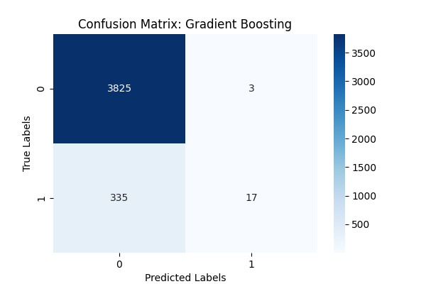
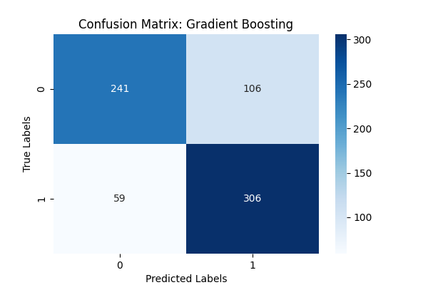
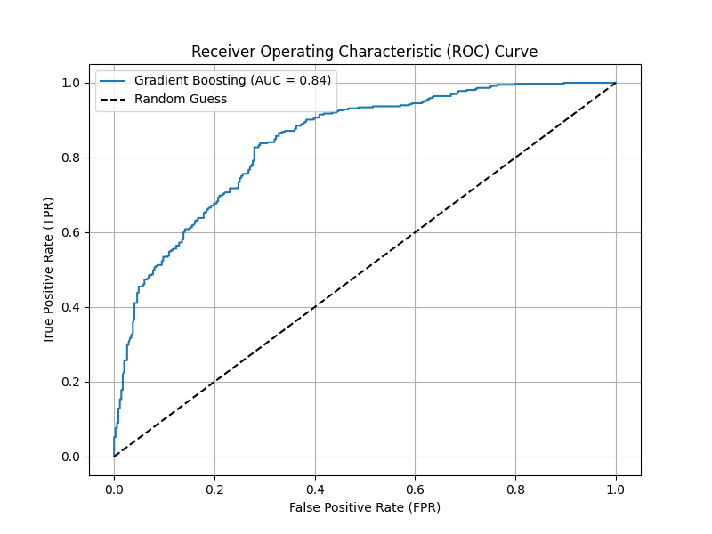
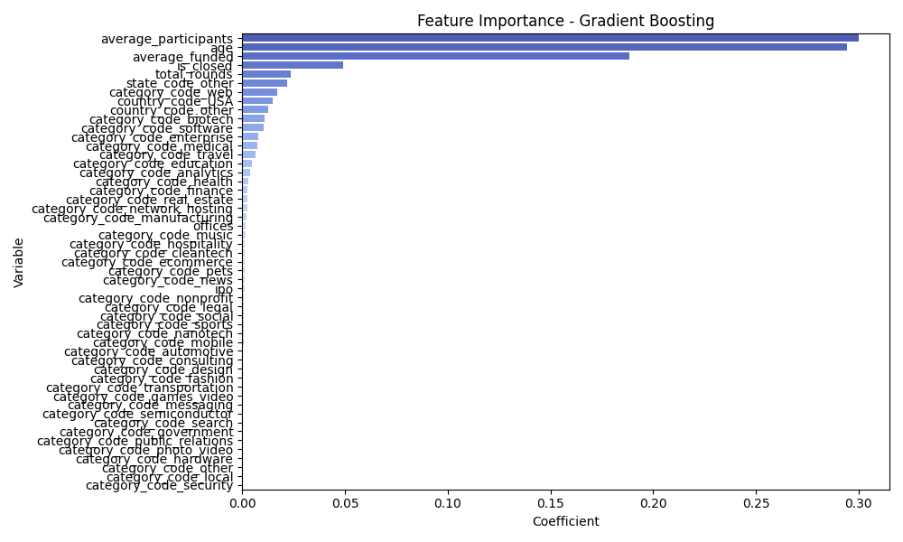

# M&Agic 8 Ball: Predictive Analytics for M&A

Mergers and acquisitions have grown substantially over the past 40 years. In 2022 alone, there were roughly [50,000 announced M&A deals](https://imaa-institute.org/mergers-and-acquisitions-statistics/) with a total valuation of 3.4 trillion USD. The dynamic nature of M&A deals often leads to significant fluctuations in company valuations, presenting exciting opportunities for savvy investors. This project seeks to predict M&A deals primarily for investment purposes.

# Filled to the Brim: Dataset 1

The first dataset comes from [Refinitiv's Eikon API](https://github.com/Refinitiv-API-Samples/Article.EikonAPI.Python.PredictionOfMandATargetsToGenerateAbnormalReturns/tree/main/Datasets). Luckily, this data is already cleaned and is well-balanced. Furthermore, there are many useful data categories such as Profit Margin and EV to EBITDA that we can train on. However, this data only has about 1300 mergers/nonmergers, though there are nearly 40 columns.

## Logistic Regression

First, using a logistic regression, this model typically achieves an accuracy of roughly .5 with a confusion matrix as follows:

The ROC curve is the following:

Finally, we have the most important predictors:

Net cash flow from operating activities, with its negative coefficient, emerges as the ultimate diviner of M&A intentions. After all, it makes sense for cash-hungry companies to entertain the prospect of merging or being acquired.

## Gradient Boosting

Shifting gears, I tried a gradient boosting model. This model achieves a higher accuracy near 55%. 

Interestingly, the gradient boosting model places a higher emphasis on net debt per share and market to book. In general, the two models (logistic and gradient boosting) seem to not place similar emphases on predictors.

# A Bigger Canvas: Dataset 2

The second dataset comes from [Crunchbase](https://github.com/Crystalnix/crunchbase-ml/tree/master/data) (though it is slightly dated). This data has many interesting categories that hadn't been considered in the previous. For example, rounds of funding, the number of people in the company with PhDs, and the number of offices are all categories in this data. (Unfortunately, many of the unique categories like number of people with PhDs had limited data for many rows and had to be removed.)

This dataset has almost 32000 mergers/nonmergers, though only about 15 columns.

Running a gradient boosting model on this data, I achieved an accuracy of .919! However, my joy was short-lived as I discovered that the false negative rate was .952.

After doing some research and inspecting my data set, I realized that the data was heavily skewed towards nonmergers. Thus I had to implement a function to preprocess the data so that mergers and nonmergers were balanced. After balancing, accuracy was still fairly good.

Notably, this model has an 84% accuracy in finding mergers and 69% accuracy in finding nonmergers.

I was pretty happy with this accuracy, so I wanted to continue exploring how M&A could be predicted.

# NLP

The news provides much insight into the M&A world, so I attempted to use sentiment analysis to gauge M&A likelihood. This sentiment analysis, coupled with the numerical model, would have a pretty good shot at predicting M&A. However, as described in [Limitations](#Limitations), it would be difficult to update information live. Therefore, I tried a few headlines from the [Reuters M&A section](https://www.reuters.com/news/archive/americasMergersNews), and the pretrained Hugging Face model did well to identify whether mergers would be likely from the title.

# Limitations

The single biggest limitation of this project was easy-accessible data. The majority of services that offer high quality information that might hint at M&A are paid-only services, and thus much of my data was historic. Ideally, I would have liked to implement my software using an API, but the lack of a freely available one did not allow me to. Therefore, I wasn't able to refine my model on new data that came in, and I had to recycle old datasets. 

Similarly, because my financial data and news sources were not synced, I could not combine them to form one model that predicts M&A, and they instead exist as disjointed pieces. If I had access to constantly updating news and data, then the NLP part of this project could've been better complemented by the previous machine learning sections. 

# Future Directions

I'd like to add a time series components to this project, evaluating how the stock price of companies predicted to be involved in M&A changes throughout a merger. Given the influence that media has on prices, it would also be interesting to see how the timing of article publication affects these prices. Perhaps then M&A trends could be better understood and investments be better made.

# Usage

Install the necessary dependencies from [here](src/requirements.txt) and dig into the M&A world.

# Applications

Despite the current limitations, the theoretical concept of this project holds practical implications for investors/financial analysts. By providing insights into factors that influence M&A decisions, the models can serve as indicators for potential M&A deals. Hopefully, by continuing to refine these models and involving more data, M&A deals can be quickly foreseen.
